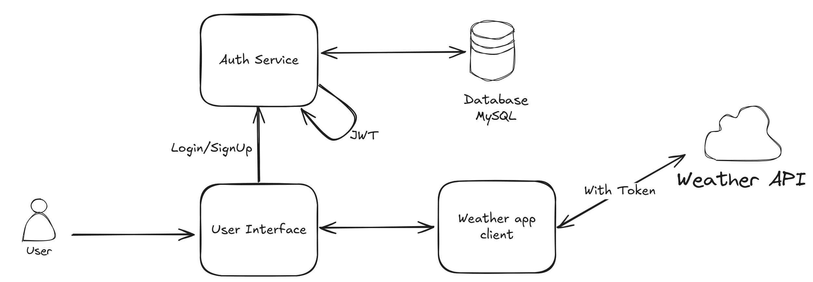

# k8s-lab
Deploy a microservice app (based on weather api) as part of learning k8s

## Environment
```shell
kind version 0.24.0
kubernetes v1.31.0
containerd v1.7.18
```

## App Architecture


## Deployment

### Create namespace for the app
```shell
kubectl create namespace weather-app
```
### Create secret for mysql auth database
A user named 'auth' will be created for interacting with weather-app database.
```shell
kubectl create secret generic mysql-secret \
  --from-literal=root-password='<root-pw>' \
  --from-literal=auth-password='<password-for-auth-user>' \
  --from-literal=secret-key='<secret-for-jwt>' \
  -n weather-app
```